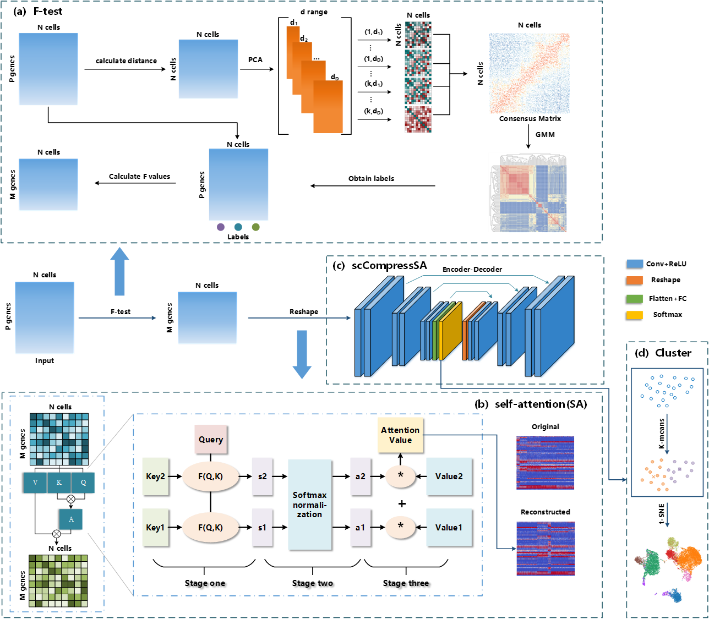
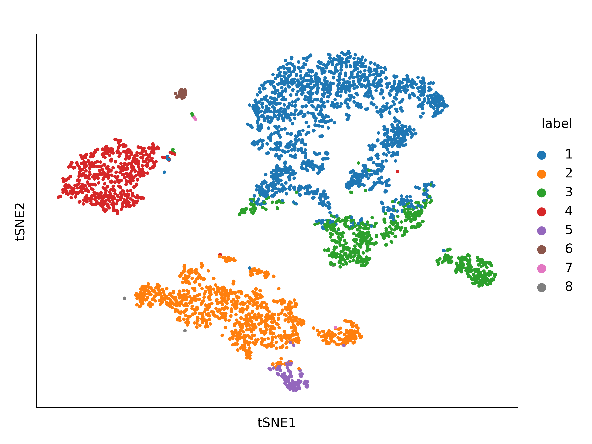
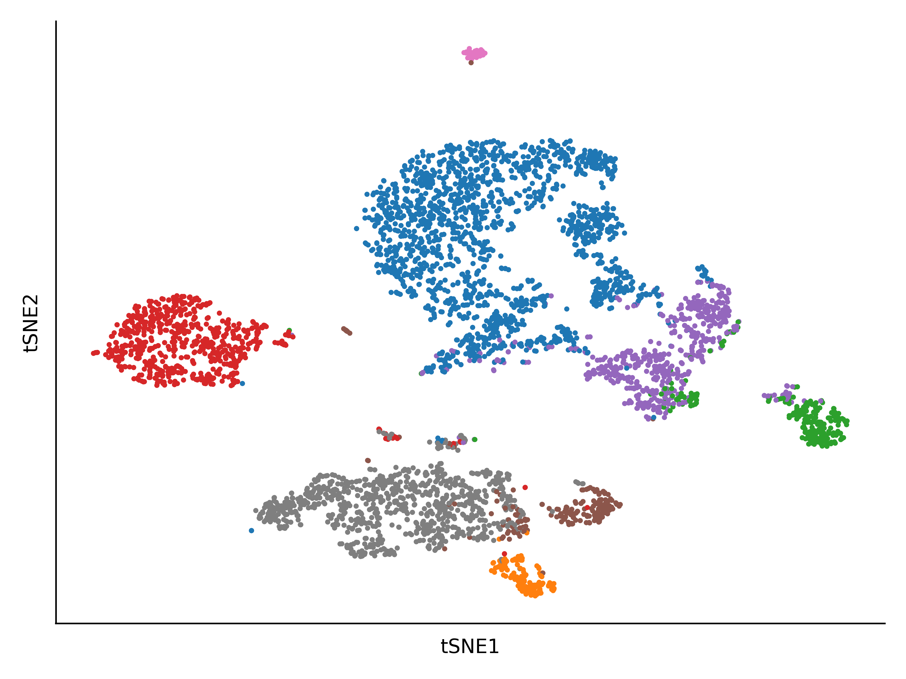

# **scCompressSA: Dual-channel self-attention based deep autoencoder model for single-cell clustering by compressing static gene-gene interactions**

Using cross-correlation to capture gene-gene interactions, this study proposes the scCompressSA method to integrate static gene-gene interactions and gene expression dynamics with self-attention(SA) based coefficient compression(CC). This dual-channel self-attention CC block has been designed to automatically integrating topological features of scRNA-seq data.

## Architecture



## Install

To use scCompressSA you must make sure that your python version is greater than 3.6. The best graphics card is RTx3080.

```
conda create -n scCompressSA python=3.6
source activate scCompressSA
```

#### Requirements

```
pip install numpy==1.23.5
pip install torchsummary==1.5.1
pip install scikit-learn==1.0.2
pip install scanpy==1.9.1
pip install pandas
torch==1.13.1+cu116
```

The required packages can be installed using the following
command:

``$ pip install -r requirements.txt``

## Data availability

Zeisel Hippocampus Dataset ([GSE60361](https://www.ncbi.nlm.nih.gov/geo/query/acc.cgi?acc=GSE60361)) from Mouse Brain Tissue 3005 cells. Mouse bladder cell dataset Mouse ([GSE60361](https://www.ncbi.nlm.nih.gov/geo/query/acc.cgi?acc=GSE60361)) from the Mouse Cell Atlas project. Dataset Chen ([GSE87544](https://www.ncbi.nlm.nih.gov/geo/query/acc.cgi?acc=GSE87544)) is from the Drop-seq platform and was obtained from single-cell RNA sequencing of adult mouse hypothalamus by Chen et al. The dataset Klein ([GSE65525](https://www.ncbi.nlm.nih.gov/geo/query/acc.cgi?acc=GSE65525)) was generated by Klein et al. who sequenced mouse embryonic stem cells using inDrop technology and obtained 2717 cells divided into 4 classes. The dataset Petropoulos ([E-MTAB-3929](https://www.ebi.ac.uk/biostudies/arrayexpress/studies/E-MTAB-3929)) is an scRNA sequence dataset with time series. pbmc_Kang-A, pbmc_Kang-B, pbmc_Kang ([GSE96583](https://www.ncbi.nlm.nih.gov/geo/query/acc.cgi?acc=GSE96583)) were sequenced from peripheral blood of normal individuals by Kang et al. pbmc_Ding ([SCP424](https://singlecell.broadinstitute.org/single_cell/study/SCP424/single-cell-comparison-pbmc-data)) was sequenced from peripheral blood of diseased individuals by Klein et al. was sequenced from the peripheral blood dataset of diseased individuals.PBMC_Zheng4K, on the other hand, is from [10X Genomics Datasets](https://support.10xgenomics.com/single-cell-gene-expression/datasets/2.1.0/pbmc4k), which are peripheral blood mononuclear cells from healthy donors .

The dataset is saved on Zenodo：https://zenodo.org/record/8256590

## Usage

If you want to run the dataset, you should first generate two files "data.csv" (gene count matrix, where rows represent cells and columns represent genes) and "label.csv" (true label). Then you can put your dataset folder containing the above two files ("data.csv" and "label.csv") into "data" .

First, you can run the F-test-Pseudo-label.R to generate the pseudo-label, then run the 1-f-test-python.ipynb to generate finall.csv, and put it in 2-preprocess.ipynb to generate the.pkl file that can run the model.

Finally, you can run the following command:

```
python main.py
```

## Results

After running the program, you will get two files, one is the data name filename.txt file, this file records the model running log, the other is the predictive data clustering labels, which is a.csv file.

We show an example on how to create two tSNE plots with the clustering result and the true cell types.  The command can be found in the 3-analysis.ipynb.

In the following two images, the first image is colored with true labels, and the second image is colored with clustering results.




